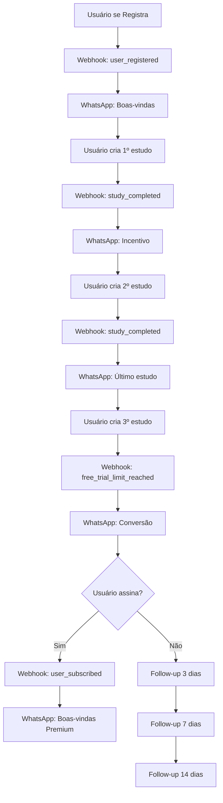

# N8N + WhatsApp Automation Setup for Corretor Consultor

Este documento detalha como implementar a automação completa de conversão de leads via N8N e WhatsApp para o sistema de teste grátis do Corretor Consultor.

## 📋 Visão Geral do Sistema

O sistema implementa 4 webhooks específicos que são acionados automaticamente:

1. **user-registered-webhook**: Quando um novo usuário se cadastra
2. **study-completed-webhook**: Quando um usuário completa um estudo
3. **free-trial-limit-reached-webhook**: Quando o limite de 3 estudos é atingido
4. **user-subscribed-webhook**: Quando um usuário assina o plano premium

## 🔗 Webhooks Implementados

### 1. User Registered Webhook
**URL**: `https://kxnikregrasjkjntoyhm.supabase.co/functions/v1/user-registered-webhook`

**Payload**:
```json
{
  "event_type": "user_registered",
  "user_data": {
    "user_id": "uuid",
    "email": "user@example.com",
    "full_name": "Nome Completo",
    "phone_number": "+5511999999999",
    "free_studies_limit": 3,
    "insurance_company": "Corretora XYZ",
    "registration_date": "2024-01-01T10:00:00.000Z"
  },
  "message_template": "welcome_new_user"
}
```

### 2. Study Completed Webhook
**URL**: `https://kxnikregrasjkjntoyhm.supabase.co/functions/v1/study-completed-webhook`

**Payload**:
```json
{
  "event_type": "study_completed",
  "user_data": {
    "user_id": "uuid",
    "email": "user@example.com",
    "full_name": "Nome Completo",
    "phone_number": "+5511999999999",
    "free_studies_used": 1,
    "free_studies_remaining": 2,
    "completion_date": "2024-01-01T10:00:00.000Z"
  },
  "message_template": "study_completed_one_remaining" // ou "study_completed_two_remaining"
}
```

### 3. Free Trial Limit Reached Webhook
**URL**: `https://kxnikregrasjkjntoyhm.supabase.co/functions/v1/free-trial-limit-reached-webhook`

**Payload**:
```json
{
  "event_type": "free_trial_limit_reached",
  "user_data": {
    "user_id": "uuid",
    "email": "user@example.com",
    "full_name": "Nome Completo",
    "phone_number": "+5511999999999",
    "limit_reached_date": "2024-01-01T10:00:00.000Z",
    "conversion_opportunity": true
  },
  "message_template": "trial_limit_reached_conversion",
  "priority": "high",
  "campaign_type": "immediate_conversion"
}
```

### 4. User Subscribed Webhook
**URL**: `https://kxnikregrasjkjntoyhm.supabase.co/functions/v1/user-subscribed-webhook`

**Payload**:
```json
{
  "event_type": "user_subscribed",
  "user_data": {
    "user_id": "uuid",
    "email": "user@example.com",
    "full_name": "Nome Completo",
    "phone_number": "+5511999999999",
    "subscription_plan": "pro",
    "subscription_date": "2024-01-01T10:00:00.000Z",
    "conversion_successful": true
  },
  "message_template": "premium_welcome",
  "campaign_type": "welcome_premium"
}
```

## 🚀 Configuração do N8N

### Passo 1: Configurar Variáveis de Ambiente
No Supabase, configure a variável de ambiente:
- **N8N_WEBHOOK_URL**: URL do seu webhook principal do N8N

### Passo 2: Criar Webhook Principal no N8N
Crie um webhook que receberá todos os eventos e distribuirá para os fluxos corretos:

```javascript
// Webhook Trigger Node Configuration
{
  "httpMethod": "POST",
  "path": "corretor-consultor-webhook",
  "responseMode": "responseNode"
}
```

### Passo 3: Criar Switch Node para Distribuir Eventos
Configure um Switch Node para direcionar cada tipo de evento:

```javascript
{
  "conditions": {
    "boolean": [],
    "dateTime": [],
    "number": [],
    "string": [
      {
        "value1": "={{ $json.event_type }}",
        "operation": "equal",
        "value2": "user_registered"
      },
      {
        "value1": "={{ $json.event_type }}",
        "operation": "equal", 
        "value2": "study_completed"
      },
      {
        "value1": "={{ $json.event_type }}",
        "operation": "equal",
        "value2": "free_trial_limit_reached"
      },
      {
        "value1": "={{ $json.event_type }}",
        "operation": "equal",
        "value2": "user_subscribed"
      }
    ]
  }
}
```

## 📱 Fluxos de WhatsApp

### Fluxo 1: Boas-vindas (user_registered)
**Template**: `welcome_new_user`

**Mensagem**:
```
🎉 *Olá, {{ $json.user_data.full_name }}!*

Bem-vindo ao *Corretor Consultor*! 

Você tem *3 estudos gratuitos* para descobrir como nossa plataforma pode revolucionar suas vendas de seguro de vida.

✨ *O que você pode fazer:*
• Criar estudos profissionais em minutos
• Impressionar seus clientes com análises detalhadas  
• Aumentar sua taxa de conversão

🚀 *Comece agora:* https://app.corretorconsultor.com

Qualquer dúvida, é só responder esta mensagem!
```

### Fluxo 2: Incentivo de Uso (study_completed)
**Template**: `study_completed_two_remaining`

**Mensagem**:
```
🎯 *Parabéns, {{ $json.user_data.full_name }}!*

Você acabou de completar um estudo no Corretor Consultor!

💪 *Ainda restam {{ $json.user_data.free_studies_remaining }} estudos gratuitos* para você explorar todo o potencial da plataforma.

✅ *Você já descobriu:*
• Como criar propostas profissionais
• O poder das recomendações personalizadas

🔥 *Continue experimentando:* https://app.corretorconsultor.com

Aproveite seus estudos restantes!
```

**Template**: `study_completed_one_remaining`

**Mensagem**:
```
⚡ *{{ $json.user_data.full_name }}, você está quase lá!*

*Falta apenas 1 estudo gratuito* para você explorar completamente o Corretor Consultor!

🎯 *Você já viu como é fácil:*
• Criar estudos profissionais
• Impressionar seus clientes
• Aumentar suas vendas

💎 *Não perca a chance!* Use seu último estudo gratuito e depois continue com estudos ilimitados.

🚀 *Acesse agora:* https://app.corretorconsultor.com
```

### Fluxo 3: Conversão Imediata (free_trial_limit_reached)
**Template**: `trial_limit_reached_conversion`

**Mensagem**:
```
🚀 *{{ $json.user_data.full_name }}, VOCÊ PROVOU QUE FUNCIONA!*

Seus 3 estudos gratuitos no Corretor Consultor terminaram, e você viu o poder da nossa metodologia!

💰 *RESULTADOS COMPROVADOS:*
✅ +300% mais profissional que apresentações básicas
✅ Clientes impressionados com a qualidade técnica  
✅ Vendas recorrentes garantidas com este método

🔥 *CONTINUE DOMINANDO O MERCADO!*

Com estudos ilimitados, você economiza 40h semanais e gera mais vendas!

💎 *ATIVE O TURBO AGORA:*
👉 https://app.corretorconsultor.com/pricing

*Apenas R$ 49,99/mês* para estudos ilimitados!

Responda "SIM" se tiver alguma dúvida!
```

### Fluxo 4: Boas-vindas Premium (user_subscribed)
**Template**: `premium_welcome`

**Mensagem**:
```
👑 *BEM-VINDO AO CLUBE PREMIUM, {{ $json.user_data.full_name }}!*

🎉 Sua assinatura foi ativada com sucesso!

✨ *AGORA VOCÊ TEM ACESSO A:*
• 🚀 Estudos ilimitados
• 📊 Pipeline avançado de vendas
• 🎨 Personalização com sua marca
• 💎 Recursos exclusivos PRO

💪 *PRÓXIMOS PASSOS:*
1. Acesse o painel: https://app.corretorconsultor.com
2. Configure sua marca em Configurações
3. Comece a criar estudos sem limites!

🔥 *DICA PRO:* Com estudos ilimitados, você pode criar múltiplas propostas para o mesmo cliente e fechar mais vendas!

Bem-vindo à família Premium! 🚀
```

## 📈 Fluxo de Follow-up (Opcional)

### Webhook de Follow-up
**URL**: `https://kxnikregrasjkjntoyhm.supabase.co/functions/v1/follow-up-non-converted-webhook`

Configure um fluxo automatizado no N8N que execute periodicamente:

**Schedule Trigger**: Execute diariamente às 10:00h
**HTTP Request**: Chame o webhook de follow-up

```javascript
// Configuração do nó Schedule
{
  "rule": {
    "interval": [
      {
        "field": "cronExpression",
        "expression": "0 10 * * *" // 10:00h todos os dias
      }
    ]
  }
}

// Configuração da requisição HTTP
{
  "method": "POST",
  "url": "https://kxnikregrasjkjntoyhm.supabase.co/functions/v1/follow-up-non-converted-webhook",
  "body": {
    "followUpType": "3_days",
    "daysAfterLimit": 3
  }
}
```

### Templates de Follow-up

**Template**: `follow_up_3_days`
```
💭 *{{ $json.user_data.full_name }}, como posso ajudar?*

Faz 3 dias que você testou o Corretor Consultor...

🤔 *Alguma dúvida sobre como usar a plataforma?*

✅ Posso te ajudar com:
• Como criar estudos mais eficientes
• Dicas para impressionar seus clientes
• Estratégias para aumentar vendas

💬 *Responda qualquer dúvida!*

Ou continue de onde parou: https://app.corretorconsultor.com/pricing
```

**Template**: `follow_up_7_days`
```
🎯 *{{ $json.user_data.full_name }}, uma oportunidade especial!*

*OFERTA ESPECIAL - 7 DIAS APENAS!*

🔥 *20% DE DESCONTO* na primeira mensalidade do Corretor Consultor PRO!

✨ *Relembre os benefícios:*
• Estudos profissionais ilimitados
• Pipeline avançado de vendas
• Sua marca personalizada
• Suporte especializado

💰 *De R$ 49,99 por apenas R$ 39,99* no primeiro mês!

👉 *Use o cupom: VOLTA20*
🚀 https://app.corretorconsultor.com/pricing

Oferta válida até {{ new Date(Date.now() + 7*24*60*60*1000).toLocaleDateString('pt-BR') }}!
```

## 🔧 Configuração Técnica

### 1. API do WhatsApp Business
Configure a integração com WhatsApp Business API ou use serviços como:
- Twilio WhatsApp API
- Meta WhatsApp Business API
- Evolution API (gratuito)

### 2. Variáveis de Ambiente no N8N
```env
WHATSAPP_API_URL=sua_url_da_api
WHATSAPP_TOKEN=seu_token
WHATSAPP_PHONE_ID=seu_phone_id
```

### 3. Nó HTTP Request para Envio
```javascript
{
  "method": "POST",
  "url": "{{ $env.WHATSAPP_API_URL }}/messages",
  "headers": {
    "Authorization": "Bearer {{ $env.WHATSAPP_TOKEN }}",
    "Content-Type": "application/json"
  },
  "body": {
    "messaging_product": "whatsapp",
    "to": "{{ $json.user_data.phone_number }}",
    "type": "text",
    "text": {
      "body": "{{ $json.message_content }}"
    }
  }
}
```

## 📊 Métricas e Tracking

Implemente tracking para medir:
- Taxa de abertura das mensagens
- Taxa de clique nos links
- Taxa de conversão por template
- Tempo médio para conversão

## 🚨 Considerações Importantes

1. **Compliance**: Certifique-se de ter opt-in dos usuários para WhatsApp
2. **Rate Limiting**: Respeite os limites da API do WhatsApp
3. **Fallbacks**: Implemente fallbacks para email se WhatsApp falhar
4. **Testing**: Teste todos os fluxos em ambiente de desenvolvimento
5. **Monitoring**: Configure alertas para webhooks que falharem

## 🔄 Fluxo Completo de Conversão



Este sistema garante uma jornada completa de conversão automatizada via WhatsApp, maximizando as chances de converter leads em clientes pagantes.